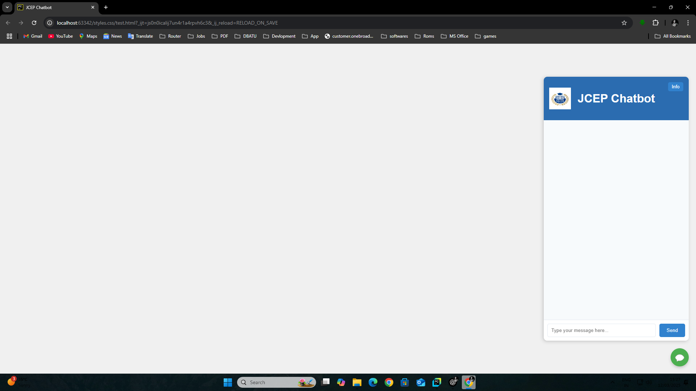
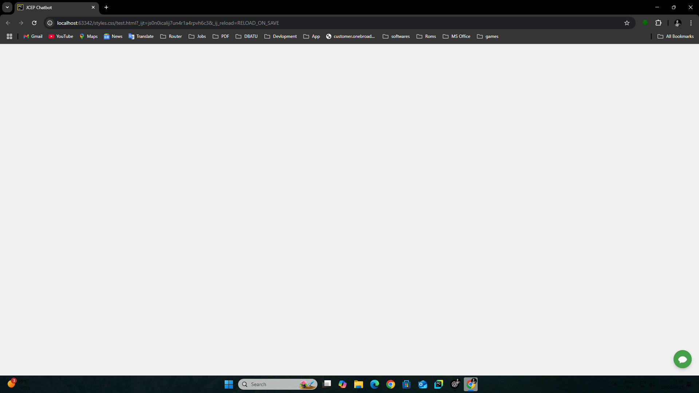

---

## 🚀 **JCEP AI Chatbot**
JCEP AI Chatbot is a web-based chatbot powered by a Python backend using Flask. It allows users to ask questions through a web interface, processes the input using a fine-tuned LLaMA model, and returns intelligent responses.

---

## 📁 **Project Structure**
```
project/
├── jcep.py                    # Flask backend
├── templates/
│   └── index.html             # HTML frontend
├── static/
│   ├── styles.css             # CSS styles
│   └── script.js              # JavaScript functionality
├── DataBase/
│   ├── chat_data.db           # SQLite database storing questions and answers
│   └── images/
│       └── jep.jpg            # Chatbot logo
├── README.md                  # Project documentation
```

---

## ⚙️ **Setup Instructions**
### 1. **Install Dependencies**
Make sure you have Python and pip installed. Install the required Python libraries:

```bash
pip install flask scikit-learn ollama
```

---

### 2. **Database Setup**
1. Create a `DataBase` folder in the root directory.
2. Add a `chat_data.db` file with the following schema:

```sql
CREATE TABLE chat_history (
    id INTEGER PRIMARY KEY AUTOINCREMENT,
    question TEXT NOT NULL,
    answer TEXT NOT NULL
);
```

3. Insert sample data:
```sql
INSERT INTO chat_history (question, answer) VALUES 
('What is AI?', 'AI stands for Artificial Intelligence.');
```

---

### 3. **Run Flask Server**
Start the Flask server:

```bash
python jcep.py
```

✅ Flask should start at:  
👉 `http://127.0.0.1:5000`

---

### 4. **Access the Chatbot**
1. Open the browser and go to:

```
http://127.0.0.1:5000
```

2. Ask a question using the chat interface! ✅

---

## 🧠 **How It Works**
### ✅ **Backend (Python + Flask)**
1. Flask serves the HTML and static files.
2. User input is sent to `/get_response` using a POST request.
3. Python backend:
   - Loads questions and answers from the SQLite database.
   - Finds the best matching question using `scikit-learn`.
   - If no match, sends the input to a fine-tuned LLaMA model using `ollama`.
   - Returns the AI-generated response.

---

### ✅ **Frontend (HTML + CSS + JS)**
1. HTML and CSS define the chatbot interface.
2. `script.js`:
   - Handles user input.
   - Sends requests to Flask using `fetch`.
   - Displays responses in the chat window.
   - Opens/closes the chatbot window using a button.

---

## 🏆 **Key Features**
✔️ AI-driven responses using LLaMA  
✔️ scikit-learn matching for user input  
✔️ Clean and responsive chat interface  
✔️ Python-based backend  
✔️ Flask for web server and routing  

---

## 📸 **Screenshots**
| Opened Chatbot                       | Closed Chatbot                        |
|--------------------------------------|---------------------------------------|
|  |  |

---

## 🚨 **Troubleshooting**
| Issue | Solution |
|-------|----------|
| CSS not loading | Ensure CSS is in the `static` folder and `url_for` is set correctly |
| Database not found | Make sure `chat_data.db` is in the `DataBase` folder |
| Flask not running | Ensure Python dependencies are installed correctly |

---

## 👨‍💻 **Developers**
- Vishwajeet Yadav  
- Omkar Patil  
- Gautami Pawar  
- Dipali Mane  

**Under the guidance of:**  
- Mr. S.Y. Inamader  

---

## 🎯 **Future Improvements**
- ✅ Improve accuracy of AI model  
- ✅ Add support for multimedia responses  
- ✅ Enhance GUI design  

---

## 🏆 **Project Completed!** 🎉

---
